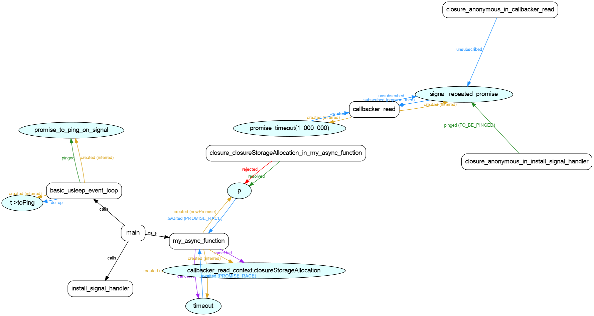

# c42 Async State Machine Compiler

`c42` lets you structure your logic using familiar, modern paradigms inspired by JavaScript's **async/await/catch** model and promise chains while keeping low-level resource ownership and manual storage responsibilities completely transparent.

In addition to compiling your state machine to `c11`, `c42` can provide a visualization of your state machine.

